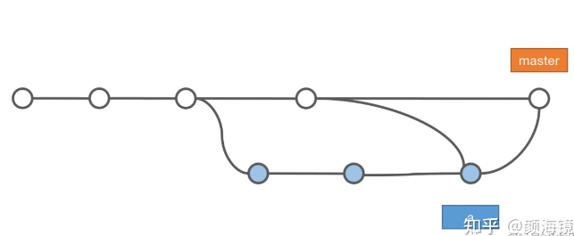
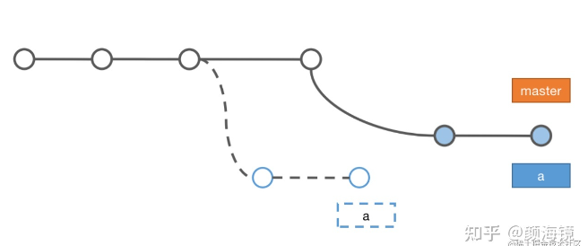
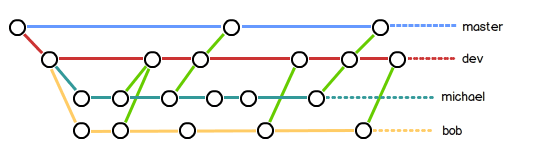

# 合并分支

## `merge`
快速合并优先

### 快速合并(`Fast forward`)
- 提交历史的连续没有分叉的， `git merge` **默认**使用这种方式
- 直接将 `master` 指向 `feature/a` 最新提交节点 `HEAd` 指向 `master`
- 合并时不会生成一个新的合并 `commit`，历史记录是线性的
```
git merge feature/a
```


### 非快速合并（`no Fast forward`）
- 两个分支有不同的提交记录时历史记录会有分叉
- 合并的时候会生成一个新的 `commit`
```
# 有分叉默认会使用非快速合并
git merge feature/a
# 显式的指定合并时生成新的节点
git merge --no-ff feature/a
```


### 手动强制生成合并节点
`git merge --no-ff`
适用于版本回滚, 回滚整个分支合并的结果生成一个反向的提交

### 压缩合并（`Squash`）
- 将分支的所有提交合并时压缩为一个 `commit`，合并后需要手动提交这个 `commit`
- 将原分支的提交记录丢弃合并为单次修改

```
git merge --squash feature/a
```


## `rebase`
- 将合并分支上面的记录挪动到目标分支上，提交历史保持**线性**
- 原始分支的提交会被重新排列并可能产生新的哈希值
- 不对已经推送到远程的分支执行 `rebase` 会导致不同开发者的历史记录不同

```
git rebase feature/a
```

## 合并和变基

新建分支a后主分支可能会有新的提交, 为了同步主分支的内容可使用rebase 获取 merge
- `rebase`: 同步`commit`记录更干净,**每次**同步时都会把主分支的`commit`都放在最前面, 本分支的提交都放最后(最新), 
  - 缺点是也会把提交的时间线打乱, 因此后续需要使用`merge --squash`压缩后合并回主分支(`merge --no-ff`也是一种选择, 但时间线依旧是乱的)
  - 不建议在公共分支上使用, 建议在自己的本地分支使用
- `merge`: 会把主分支的改动同步正常合并过来, 如果本分支不关注主分支的历史记录, 只关注改动结果的话就不太合适
  - `squash`: 不应该使用`squash`进行同步, 因为他是合并成一个新的`commit`不知道是哪个分支来的, 会导致下次同步时有不必要的冲突

### 合并（merge）

 ```
git merge master
git checkout master
git merge feature/a
```


### 变基 （rebase）
变基会修改`feature/a`的历史，就像 `feature/a` 是在 `master` 之后开发的一样
```
git rebase master
git checkout master
git merge feature/a
```


## 团队开发
* 不在`master`开发，仅仅只是拿来合并发布版本
* 日常开发在`dev`分支
* 每个人在`dev`分支中新建自己的分支并开发
* 每个人不时的向`dev`分支合并
* 大版本开发完之后将`dev`向`master`合并发布


