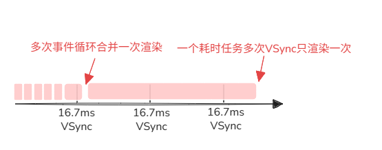
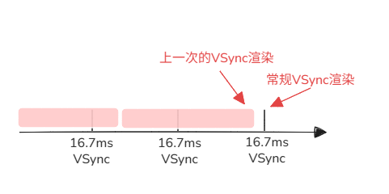

# 事件循环 `Event loop (message loop)`

## 核心概念

- `js` 是单线程的, 但是浏览器(宿主环境)是多线程的
- 事件循环的本质是`js`与宿主环境各种线程之间的通信协议
- 事件循环使得单线程的 `js` 也能实现异步编程
- 核心组件
  - 主线程 `Main Thread` : `js` 代码执行的线程
  - 调用栈 `Call Stack` : 后进先出
  - 队列 `Queue` : 先进先出
    - ~~宏任务队列 `Macrotask` (过时)~~
    - **任务队列 `Task` (现在)**
    - 微任务队列 `Microtask Queue`

## 主线程

- 单线程, 一次只能做一件事
- 负责执行 `js` 代码
- 运行事件循环
- 负责渲染页面
- 负责处理 `web api` (交互、定时器、网络请求等)的回调
- 垃圾回收

## 调用栈

- 后进先出, 本质是一块**内存区域**, 记录当前程序执行到哪里, 实际是由主线程执行
- 每进入一个函数就会在调用栈中压入一个栈帧(执行上下文)
- 函数执行完毕后就会从调用栈中弹出
- 任务 微任务 `raf` `idle` 都是在调用栈执行
- 容量有限, 如果递归调用函数会导致 `RangeError: Maximum call stack size exceeded`（栈溢出）

```js
function foo() {
  console.log("执行 foo");
}

function bar() {
  foo(); // 2. 执行 foo 时，foo 的执行上下文被压入调用栈
  console.log("执行 bar");
}

function baz() {
  bar(); // 1. 执行 bar 时，bar 的执行上下文被压入调用栈
  console.log("执行 baz");
}

baz(); // -> 触发第一步，baz 的执行上下文被压入调用栈

/* 
 * 调用栈的变化过程（后进先出）：
 * 初始化时：当前栈为 [全局执行上下文]
 * 
 * 1. 遇到 baz() 调用，进入 baz 函数作用域     -> 【压栈】当前栈结构：[..., baz]
 * 2. baz 内部调用 bar()，进入 bar 函数作用域   -> 【压栈】当前栈结构：[..., baz, bar]
 * 3. bar 内部调用 foo()，进入 foo 函数作用域   -> 【压栈】当前栈结构：[..., baz, bar, foo]
 * 4. 执行 foo() 内的打印，foo 执行完毕返回     -> 【出栈】当前栈结构：[..., baz, bar]
 * 5. 执行 bar() 内的打印，bar 执行完毕返回     -> 【出栈】当前栈结构：[..., baz]
 * 6. 执行 baz() 内的打印，baz 执行完毕返回     -> 【出栈】当前栈结构：[...] (恢复原状)
 */
```

## ~~宏任务 (过时)~~

- 非官方定义, 只是为了与微任务区分, 现在最新的规范是称为**任务 `Task`**
- `W3C` 不再使用宏队列的说法, 而是将宏任务细分为多个任务, 也可以说是微任务和其他任务

## 任务 (宿主环境创建)

- 由宿主环境创建, 本质上是待执行的回调函数
- 每次取一个任务进入调用栈供主线程执行
- 对原来的单一顺序的宏任务队列的细分, 主要是基于任务是否会阻塞用户的交互和用户体验
- 任务队列: 按优先级排队
- **优先级**: 现代浏览器对任务队列进行了分类与提权处理，如：
  1. **交互队列**: 滚动事件、点击事件等用户交互（优先度高，为了保证用户体验）
  2. **普通队列**: 定时器回调、网络请求回调等（优先度中）
  *(注：`requestAnimationFrame` 和 `requestIdleCallback` 严格意义上不属于这里说的任务队列，它们是附着在渲染流水线和空闲阶段中的特殊回调列表)*

## 微任务 (js引擎创建)

- 由 `js` 引擎创建, 本质上是待执行的回调函数
- 每次取一个微任务进入调用栈供主线程执行, 清空微任务队列是循环这个操作
- 主要是 `Promise.then` `await` `queueMicrotask` `MutationObserver` 和 `nodejs` 的 `process.nextTick`
- 微任务队列: 由多个微任务组成, 遵循先进先出, 每次事件循环需要确保队列完全清空
- 微任务队列清空时产生新的微任务, 依旧会被加入到当前的微任务队列中, 直到微任务队列清空

## 任务与微任务的“优先级”辨析

- 严格来说，任务(`Task`)和微任务(`Microtask`) **不存在同队列下的优先级比较关系**，它们属于事件循环的不同生命周期阶段。
- 只有当前调用的任务完全执行完毕（调用栈清空）后，主线程才会去“清空微任务队列”。
- **“微任务总是紧跟在当前任务之后、并且在进入下一个新任务（或渲染）之前被执行”**。

## 事件循环执行顺序

### 简单版

1. 同步代码(第0个任务)
2. 执行并清空微任务队列
  - 期间产生的微任务也会被清空
  - 执行完毕后不一定会渲染页面(看是否触发了显示器刷新周期 `VSync`)
3. `requestAnimationFrame`: 渲染前执行
4. 渲染页面: 渲染发生在清空微任务之后或者触发显示器刷新周期
5. `requestIdleCallback`: 在事件循环空闲时执行
6. 执行下一个任务
7. 重复2-6

### 详细版

- 任务执行顺序
  1.1 调度: 事件循环根据优先级拿到当前需要执行的任务给到主线程
  1.2 入栈: 主线程将任务压入调用栈
  1.3 执行: 主线程执行任务, 期间嵌套调用函数, 可能会不断压栈出栈
  1.4 出栈: 同步代码执行完毕, 调用栈清空, 下一步执行微任务
- 微任务执行
  2.1 执行: 主线程按顺序取出单个微任务压入调用栈执行, 期间嵌套调用函数, 可能会不断压栈出栈
  2.2 循环: 循环执行直至清空微任务队列, 执行期间可能会产生新的微任务, 依旧会被加入到当前的微任务队列中, 直到微任务队列清空
  2.3 出栈: 微任务执行完毕, 调用栈清空, 下一步渲染页面
- 渲染
  3.1 渲染: 根据 `VSync` 信号和任务队列的情况决定是否渲染

## 渲染

- `VSync`: 垂直同步信号, 浏览器渲染的刷新周期, 一般为 `16.67ms` (60帧/秒)
- 渲染会阻塞事件循环, 等待渲染完毕才会走下一个任务

### 渲染执行 

- 一般是在微任务清空后执行, 但不是每次微任务清空后都会渲染, 分以下情况

#### 1. 队列没有任务时

- 会等待下一个 `VSync` 信号进行渲染
  
#### 2. 队列存在任务时

- 为了确保性能, 会尽力执行任务, 所以会在一个 `VSync` 周期内执行多个(宏)任务, 不会每一次事件循环(微任务执行完)都渲染, 而是会跳过一些, 等到接收到 `VSync` 信号并且清空当前事件循环的微任务后再渲染
- 执行的(宏)任务时间超过了多个 `VSync` 信号周期, 最终都会合并渲染一次
  

- 因为等待任务执行而延后的渲染正好临近下一个 `VSync` 信号周期, 正好后续没有任务的话就会在短时间内执行两次渲染
  

### 渲染卡顿

- 任务执行时间过长, 超过了 `VSync` 信号周期, 但是最终都会渲染
- 微任务如果递归添加新的微任务就会导致页面完全卡死

## `Promise` 的执行

- `Promise` 的执行是同步的, `Promise.then` `Promise.catch` `Promise.finally` 是微任务

```js
console.log(1); // 同步代码

setTimeout(() => {
  console.log(2); // 任务
}, 0);

Promise.resolve().then(() => {
  console.log(3); // 微任务
});

console.log(4); // 同步代码

// 1 4 3 2
```

## `async/await`
- `async` 函数调用时会立即同步执行函数体内的代码, 直到遇到第一个 `await`
- `await` 右侧的表达式会同步求值, 但 `await` **之后**的所有代码会被包装成微任务（相当于 `Promise.then` 的回调）放入微任务队列

```js
async function async1() {
  console.log(1); // 同步代码
  await async2(); // await 后面的代码会被包装成一个微任务 Promise.then 放入微任务队列
  console.log(2); // 微任务
}

async function async2() {
  console.log(3); // 同步代码
}

async1();
console.log(4);

// 1 3 4 2
```

## 异步

- 因为 `js` 是单线程语言, 所以需要异步
- 事件循环是异步的实现方式
- `js` 不管异步任务的执行, 而是由多线程的宿主环境(浏览器)来执行

### 一些异步任务

| 异步任务类型 | 任务分类 | 宿主环境 | 性质与说明 |
| :--- | :--- | :--- | :--- |
| `setTimeout` / `setInterval` | **任务 (Task)** | 浏览器 / Node.js | 最基础的定时任务 |
| `setImmediate` | **任务 (Task)** | Node.js | 极其特殊的任务，在当前轮次 Check 阶段执行 |
| `MessageChannel` | **任务 (Task)** | 浏览器 / Node.js | 常用于实现 `setImmediate` 的 polyfill |
| 事件监听 (点击、滚动等) | **任务 (Task)** | 浏览器 | 用户交互产生的回调 |
| 资源加载 (`onload` 等) | **任务 (Task)** | 浏览器 / Node.js | 网络或文件 I/O 完成后的回调 |
| `I/O` 回调 | **任务 (Task)** | Node.js | `fs`, `net` 等底层操作的回调 |
| `Web Workers (onmessage)` | **任务 (Task)** | 浏览器 | 跨线程通信的回调 |
| `fetch` 网络派发与 `XHR` 回调 | **任务 (Task)** | 浏览器 / Node.js | 宿主底层 HTTP 网络请求完成后的任务派发 |
| `process.nextTick` | **微任务 (Microtask)**| Node.js | Node.js 特有，优先级高于所有其他微任务 |
| `Promise.then / catch / finally` | **微任务 (Microtask)**| 浏览器 / Node.js | ES6 标准微任务，微队列的核心 |
| `MutationObserver` | **微任务 (Microtask)**| 浏览器 | 监听 DOM 树变化的回调 |
| `queueMicrotask` | **微任务 (Microtask)**| 浏览器 / Node.js | 现代浏览器与 Node.js 提供的原生微任务入队方法 |
| `requestAnimationFrame` | **渲染回调 (Rendering)**| 浏览器 | 渲染流水线重绘前执行的回调 |
| `IntersectionObserver` | **渲染回调 (Rendering)**| 浏览器 | 监控元素可见性的回调，属于渲染流水线的一环 |
| `requestIdleCallback` | **空闲回调 (Idle)** | 浏览器 | 渲染完成后的空闲期执行，不属于 Task 或 Microtask |

::: tip **说明：** 
**1. 关于 `fetch`：** `fetch` 本身调用会返回一个 `Promise`，因此我们为其编写的回调（`.then`）属于**微任务**。即便浏览器在底层完成网络请求时，会产生一个**任务 (Task)**来将该 Promise 决议为 resolved，但在代码使用层面，我们通常将 `fetch` 视作微任务体系的一部分。
**2. 关于 `async/await`：** 它们不是某种独立的异步任务类型，而是 `Promise` 的语法糖。`await` 之前的内容是同步执行的，而 `await` 之后的内容会被放入微任务队列（相当于 `Promise.then`）。
:::

### 执行顺序

#### 任务(task)类型的异步

1. 发起: 执行同步任务时遇到任务(task)类型的异步, 将其委托给对应的宿主线程执行, 如定时器线程
2. 等待: 主线程正常执行后续的同步代码以及后续的任务(正常的事件循环)
3. 响应: 宿主线程执行完毕后, 将任务(task)对应的回调放入任务队列
4. 执行: 主线程执行任务(task)对应的回调

#### 微任务(microtask)类型的异步 

1. 发起: 执行同步代码时遇到了产生微任务的 API（如 `Promise.resolve().then(...)` 或 `MutationObserver` 响应）。
2. 入队: JS 引擎会直接将微任务的对应的回调函数推入**微任务队列**。
   *(注：微任务由 JavaScript 引擎内部处理，不会像宏任务那样跨宿主线程去“委托等待”。例如，`fetch` 是跨网络线程执行的宏任务机制，但当其底层响应完毕、把相关的 `Promise` 给 resolve 之后，随之产生的 `.then` 才是这个纯粹的微任务。这两者不要混为一谈。)*
3. 执行: 在当前任务代码完毕、调用栈清空后，主线程立刻依次执行微任务队列中积压的所有微任务。

## 其他知识

- `setTimeout` 在`5`层嵌套后最小延迟时间为4ms

