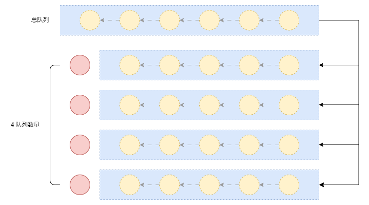

# 文件上传

## 普通上传
- 直接将文件对象通过 `FromData` 的方式上传到后端即可

:::tip
  `FromData` 的 `append` 会将数字自动转字符串
:::

## 分片上传
- 主要注意文件的切片上传队列并发控制
- 上传状态处理
- 单个任务的错误处理




### 创建类
```js
class FileUploader {
    constructor(file, options = {}) {
        this.file = file
        const { chunkSize = 5, api, onProgress = () => { }, maxConcurrency = 5 } = options
        this.chunkSize = chunkSize * 1024 * 1024
  
        // 上传状态 ready: 准备上传 uploading: 上传中 pausing: 暂停中 paused: 暂停 failed: 上传失败 completed: 全部上传完成
        this.status = 'ready'
  
        this.uploadApi = api
        // 总分片数
        this.totalCount = 0
        // 已上传的分片数
        this.finishCount = 0
        // 失败的任务集合
        this.failedTasks = []
        this.onProgress = onProgress
  
        // 最大并发数
        this.maxConcurrency = maxConcurrency
        // 待上传任务
        this.taskList = []
        // 当前正在上传的任务数
        this.activeCount = 0
    }

  /** 上传状态 */
  _setStatus(status) {
    this.status = status
  }
}
```
### 文件切片方法
- 切片是一个耗时任务，考虑使用 `webWorker` 另开一个线程处理切片
- 不需要等待全部切片完成后才开始上传，只要有一定量的切片完成就能开始上传任务

```js
/** 创建切片 */
_createChunks() {
    return new Promise(async (resolve, reject) => {
        // 切片数量
        this.totalCount = Math.ceil(this.file.size / this.chunkSize)
        
        if (!window.Worker) {
          console.warn("当前浏览器不支持 Web Worker，切片将在主线程执行");
          return resolve(this._mainCutFile());
        }
        await this._workerCutFile()
    });
}

/** worker线程文件切片 */
_workerCutFile() {
    return new Promise(res => {
        let cutWorker = new Worker("worker.js");
    
        cutWorker.onmessage = (e) => {
            const chunks = e.data;
            // 关闭worker
            cutWorker?.terminate();
            cutWorker = null;
            res(chunks);
        };
    
        cutWorker.onerror = (err) => {
            cutWorker?.terminate();
            cutWorker = null;
            res(this._mainCutFile()); // 失败后回退到主线程切片
        };
    
        cutWorker.postMessage({ file: this.file, chunkSize: this.chunkSize, totalCount: this.totalCount });
    })
}

/** 主线程文件切片 */
_mainCutFile() {
    const file = this.file
    const chunkSize = this.chunkSize
    // 切片集合
    const chunks = []
  
    for (let i = 0;i < this.totalCount;i++) {
        const start = i * chunkSize;
        const end = Math.min(start + chunkSize, file.size);
        chunks.push({
            index: i,
            chunk: file.slice(start, end, file.type),
        });
    }
    return chunks
}
```

```js title='worker.js'
self.onmessage = function (e) {
    const { file, chunkSize, totalCount } = e.data;
    const chunks = [];
  
    for (let i = 0; i < totalCount; i++) {
        const start = i * chunkSize;
        const end = Math.min(start + chunkSize, file.size);
        chunks.push({
          index: i,
          chunk: file.slice(start, end, file.type),
        });
    }
  
    // 传回主线程
    self.postMessage(chunks);
};
```


### 单个分片上传
```js
/** 上传分片 */
async _uploadChunk(chunk) {
    const formData = new FormData();
    formData.append("chunkFile", chunk.chunk);
    formData.append("index", chunk.index);
    formData.append("total", this.totalCount);
    formData.append("fileName", this.file.name);
    await this.uploadApi(formData);
}
```

### 任务队列执行函数
1. 这里创建的是一个自动往里添加任务的任务队列
2. 最大并发是4的话就执行4次
3. 这里的4条线程都会在一个任务完成后自动添加下一个任务
4. 后续无任务后这里的4个 `promise` 才会结束
   
```js
/** 创建队列 */
async _queue() {
    while (this.taskList.length > 0) {
        // 如果暂停或状态变更 停止队列
        if (this.status !== 'uploading') break;

        // 从队列中取出一个任务
        const task = this.taskList.shift();
        // 记录活跃任务数
        this.activeCount++;

        try {
            await task(); // 执行上传任务
            this.finishCount++;
            this.onProgress(Math.round(this.finishCount / this.totalCount * 100));
        } catch (err) {
            // 暂停中失败的任务不直接进入失败列表 而是重新添加到任务列表
            if(this.status === 'pausing') {
                this.taskList.push(task)
                // return 会终止整个_queue
                continue
            }
            // 上传失败，将分片重新放入失败列表
            this.failedTasks.push(task)
        } finally {
            this.activeCount--; // 任务完成，减少活跃任务数
            if(this.status === 'pausing' && this.activeCount === 0) this._setStatus('paused')
        }
    }
}

/** 开启队列任务 */
async _runTaskQueue() {
    this._setStatus('uploading')

    const queue = []
    // 创建最大并发数量的任务队列
    for (let i = 0;i < this.maxConcurrency;i++) {
        queue.push(this._queue());
    }
    await Promise.all(queue);
    if (this.failedTasks.length) return this._setStatus('failed')
    if (!this.taskList.length) this._setStatus('completed')
}
```

### 开始上传
```js
async upload() {
    if (!this.uploadApi) throw new Error("上传接口未定义");
    // 文件切片
    const chunks = this._createChunks()

    // 初始化任务队列
    this.taskList = chunks.map((chunk) => () => this._uploadChunk(chunk));
    // 创建队列开始上传
    await this._runTaskQueue()
}
```

### 失败重传
- 收集上传失败的分片任务进行统一重试
```js
/** 失败的分片进行重传 */
async retry() {
    if (!this.failedTasks.length) return console.warn('没有失败的任务');
    if (!navigator.onLine) return console.error('当前网络不可用，请检查网络连接后重试');
    // 将失败的上传任务重新加入任务列表
    this.taskList = [...this.failedTasks];
    // 清空失败任务列表
    this.failedTasks = [];

    await this._runTaskQueue();
}
```

### 暂停和恢复
- 这里暂停的效果是停止每个线程继续添加任务
- 正在上传的切片无法取消仍会继续上传，会有一个上传中的状态
- 暂停后正在上传的任务如果失败会直接转为正常任务
```js
/** 暂停上传 */
pause() {
    if (this.status !== 'uploading') return;
    // 暂停只是停止队列增加新任务 这里需要一个暂停中的状态
    this._setStatus('pausing');
}

/** 恢复上传 */
async resume() {
    if (this.status !== 'paused') return;

    // 重新开启任务队列 继续上传剩余任务
    await this._runTaskQueue()
}
```

### 完整代码

```ts
class FileUploader {
    constructor(file, options = {}) {
        this.file = file
        const { chunkSize = 5, api, onProgress = () => { }, maxConcurrency = 5 } = options
        this.chunkSize = chunkSize * 1024 * 1024
  
        // 上传状态 ready: 准备上传 uploading: 上传中 pausing: 暂停中 paused: 暂停 failed: 上传失败 completed: 全部上传完成
        this.status = 'ready'
  
        this.uploadApi = api
        // 总分片数
        this.totalCount = 0
        // 已上传的分片数
        this.finishCount = 0
        // 失败的任务集合
        this.failedTasks = []
        this.onProgress = onProgress
  
        // 最大并发数
        this.maxConcurrency = maxConcurrency
        // 待上传任务
        this.taskList = []
        // 当前正在上传的任务数
        this.activeCount = 0
    }

    /** 开始上传 */
    async upload() {
        if (!this.uploadApi) throw new Error("上传接口未定义");
        if (this.status !== 'ready') return
        // 文件切片
        const chunks = await this._createChunks()
        console.log('总分片数', chunks.length)
        // 初始化任务队列
        this.taskList = chunks.map((chunk) => () => this._uploadChunk(chunk));
        // 创建队列开始上传
        await this._runTaskQueue()
    }
    
    /** 开启队列任务 */
    async _runTaskQueue() {
        this._setStatus('uploading')
        
        const queue = []
        // 创建最大并发数量的任务队列
        for (let i = 0;i < this.maxConcurrency;i++) {
          queue.push(this._queue());
        }
        await Promise.all(queue);
        if (this.failedTasks.length) return this._setStatus('failed')
        if (!this.taskList.length) this._setStatus('completed')
    }

    /** 创建队列 */
    async _queue() {
        while (this.taskList.length > 0) {
            // 如果暂停或状态变更 停止队列
            if (this.status !== 'uploading') break; 
    
            // 从队列中取出一个任务
            const task = this.taskList.shift();
            // 记录活跃任务数
            this.activeCount++; 
    
            try {
                await task(); // 执行上传任务
                this.finishCount++;
                this.onProgress(Math.round(this.finishCount / this.totalCount * 100));
            } catch (err) {
                // 暂停中失败的任务不直接进入失败列表 而是重新添加到任务列表
                if(this.status === 'pausing') {
                    this.taskList.push(task)
                    // return 会终止整个_queue
                    continue
                }
                // 上传失败，将分片重新放入失败列表
                this.failedTasks.push(task)
            } finally {
                this.activeCount--; // 任务完成，减少活跃任务数
                if(this.status === 'pausing' && this.activeCount === 0) this._setStatus('paused')
            }
        }
    }


    /** 失败的分片进行重传 */
    async retry() {
        if (!this.failedTasks.length) return console.warn('没有失败的任务');
        if (!navigator.onLine) return console.error('当前网络不可用，请检查网络连接后重试');
        // 将失败的上传任务重新加入任务列表
        this.taskList = [...this.failedTasks];
        // 清空失败任务列表
        this.failedTasks = [];
  
        await this._runTaskQueue();
    }
    
    /** 暂停上传 */
    pause() {
        if (this.status !== 'uploading') return;
        // 暂停只是停止队列增加新任务 这里需要一个暂停中的状态
        this._setStatus('pausing');
    }

    /** 恢复上传 */
    async resume() {
        if (this.status !== 'paused') return;
  
        // 重新开启任务队列 继续上传剩余任务
        await this._runTaskQueue()
    }

    _setStatus(status) {
        this.status = status
        document.getElementById('status').innerText = status
    }

    /** 上传分片 */
    async _uploadChunk(chunk) {
        const formData = new FormData();
        formData.append("chunkFile", chunk.chunk);
        formData.append("index", chunk.index);
        formData.append("total", this.totalCount);
        formData.append("fileName", this.file.name);
        await this.uploadApi(formData);
    }

    /** 创建切片 */
    _createChunks() {
        return new Promise(async (resolve, reject) => {
            // 切片数量
            this.totalCount = Math.ceil(this.file.size / this.chunkSize)
            
            if (!window.Worker) {
                console.warn("当前浏览器不支持 Web Worker，切片将在主线程执行");
                return resolve(this._mainCutFile());
            }
            const chunks = await this._workerCutFile()
            resolve(chunks)
        });
    }
    
    /** worker线程文件切片 */
    _workerCutFile() {
        return new Promise(res => {
            let cutWorker = new Worker("worker.js");
    
            cutWorker.onmessage = (e) => {
                const chunks = e.data;
                // 关闭worker
                cutWorker?.terminate();
                cutWorker = null;
                res(chunks);
            };
    
            cutWorker.onerror = (err) => {
                cutWorker?.terminate();
                cutWorker = null;
                res(this._mainCutFile()); // 失败后回退到主线程切片
            };
    
            cutWorker.postMessage({ file: this.file, chunkSize: this.chunkSize, totalCount: this.totalCount });
        })
    }
    
    /** 主线程文件切片 */
    _mainCutFile() {
        const file = this.file
        const chunkSize = this.chunkSize
        // 切片集合
        const chunks = []
        
        for (let i = 0;i < this.totalCount;i++) {
            const start = i * chunkSize;
            const end = Math.min(start + chunkSize, file.size);
            chunks.push({
                index: i,
                chunk: file.slice(start, end, file.type),
            });
        }
        return chunks
    }
  }
```
